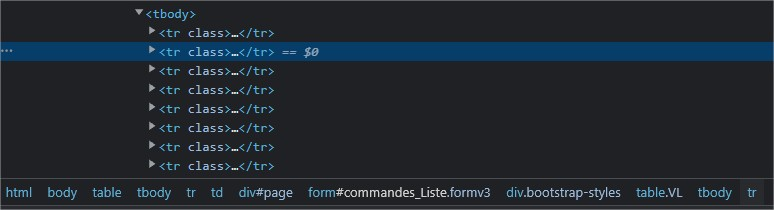
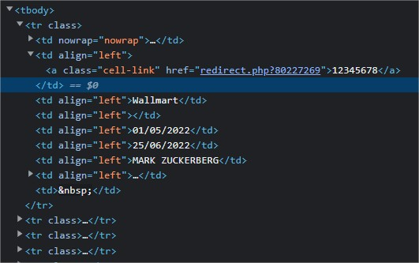

<h1>Scrape2Excel</h1>
This small program allows you to scratch a web page in order to store the data
provided in an Excel workbook.

## Context
I developed this accounting utility because I had to, as part of a
mission, retrieve customer data from the company's dashboard but the
.csv files were too big and messy, and I had to grab some
additional information by clicking on the order number, which is why I
opted for scrapping rather than conversion by regex.
<br>
This allowed me to import 456 customers into my Excel file in just 2 minutes.
<br>I used <a href="https://github.com/jhy/jsoup" target="_blank">JSoup</a> to scratch data from websites and <a href="https://github.com/Crab2died/Excel4J" target="_blank">Excel4J</a> to build .xlsx files.

## Scratch data from a website

#### Instantiate the _DataScratcher_ class
```java
// Here, the system will sleep one second between each request
DataScraper dataScraper = new DataScraper(1000L);

// Define the URLs to be scratched
dataScraper.setUrls(LINKS);

// Define cookies if you need to be connected to the website
// I advise you to use 'Cookie-Editor' Chrome extension to get cookies
dataScraper.getCookies().put("AUTH_COOKIE_NAME", "YOUR_AUTH_TOKEN");
```

#### Find the pattern corresponding to your data


In my case, the pattern matches as "tbody tbody".

#### Observe the data structure at each row of the table


#### Create your entity with Excel4j annotations
```java
import com.github.crab2died.annotation.ExcelField;

public class OrderEntity {

    @ExcelField(title = "ORDER ID", order = 1)
    private long orderID;

    @ExcelField(title = "STORE NAME", order = 2)
    private String storeName;

    @ExcelField(title = "BOUGHT DATE", order = 3)
    private String boughtDate;

    @ExcelField(title = "DELIVERY DATE", order = 4)
    private String deliveryDate;

    @ExcelField(title = "LASTNAME", order = 5)
    private String lastName;

    @ExcelField(title = "FIRSTNAME", order = 6)
    private String firstName;

    public OrderEntity() { }

    public OrderEntity(long orderID, String lastName, String firstName, String boughtDate, String deliveryDate) {
        this.setOrderID(orderID);
        this.setLastName(lastName);
        this.setFirstName(firstName);
        this.setBoughtDate(boughtDate);
        this.setDeliveryDate(deliveryDate);
    }

    public long getOrderID() { return orderID; }

    public void setOrderID(long orderID) { this.orderID = orderID; }

    public String getStoreName() { return storeName; }

    public void setStoreName(String storeName) { this.storeName = storeName; }

    public String getLastName() { return lastName; }

    public void setLastName(String lastName) { this.lastName = lastName; }

    public String getFirstName() { return firstName; }

    public void setFirstName(String firstName) { this.firstName = firstName; }

    public String getBoughtDate() { return boughtDate; }

    public void setBoughtDate(String boughtDate) { this.boughtDate = boughtDate; }

    public String getDeliveryDate() { return deliveryDate; }

    public void setDeliveryDate(String deliveryDate) { this.deliveryDate = deliveryDate; }

    @Override
    public String toString() {
        return "Order{" +
                "orderID='" + orderID + '\'' +
                ", storeName='" + storeName + '\'' +
                ", lastName='" + lastName + '\'' +
                ", firstName='" + firstName + '\'' +
                ", boughDate='" + boughtDate + '\'' +
                ", deliveryDate='" + deliveryDate + '\'' +
                '}';
    }
}
```

#### Retrieve data and instantiate the entity object
```java
dataScraper.getCookies().put("auth", "052z5x8v3f32aa36b042d2e5b3f054d8");

String pattern = "tbody tbody";

List<OrderEntity> orderList = dataScraper.scrape(pattern, (doc, element) -> {

    // Passing elements that not tagged by 'tr'
    if (!element.is("tr")) return null;
    
    OrderEntity order = new OrderEntity();
    
    String elementText = element.text();
    String[] data = elementText.split(" ");
    // -> output: [orderID] [storeName] [boughtDate] [deliveryDATE] [fullName]
    
    // Collect needed data from element's children
    long orderId = Long.parseLong(element.child(1).text());
    String storeName = element.child(2).text();
    String boughtDate = element.child(4).text();
    String deliveryDate = element.child(5).text();
    String fullName = element.child(6).text();
    
    String[] fullNameSplit = fullName.split(" ");
    String firstName = fullNameSplit[fullNameSplit.length - 1];
    String lastName = fullName.replaceAll(firstName, "").trim();
    
    // Set collected data to your entity object
    order.setOrderID(orderId);
    order.setStoreName(storeName);
    order.setBoughtDate(boughtDate);
    order.setDeliveryDate(deliveryDate);
    order.setLastName(lastName);
    order.setFirstName(firstName);

    return order;
}).toList();
```

#### Export collected data to a new Excel sheet
```java
// Export data to excel using Excel4j
final String TARGET_PATH = "path/newFileName.xlsx";
try {
    ExcelUtils.getInstance().exportObjects2Excel(orderList, OrderEntity.class, true, "YOUR SHEET NAME", true, TARGET_PATH);
} catch (Excel4JException exception) {
    exception.printStackTrace();
}
```
